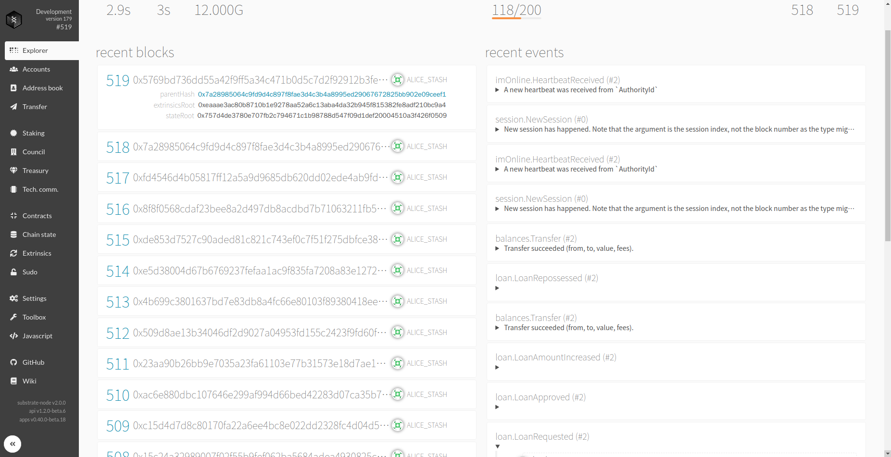

# Blockchain based automated loan processing system

# Implementation

The module has 6 dispatchable functions. Each function goes through the example with bob and alice.

## `request`

#### `inputs`:

- `origin`: sender of the extrinsic
- `lender`: lender address to owe
- `amount`: amount of balance that the lender will transfer without regarding the extrinsic fee
- `expires_at`: The date in blocknumber that the borrower will pay the debt
- `interest`: interest rate in precision of 1000(e.g. if the argument is 10 then 10/1000 = 1/100(1%))
- `collateral`: amount of balance to transfer to the lender when borrower fails to pay debt
- `period`: period which the bond will activate

#### `what it does`:
generates a bond to the approver with random hash and store in `<Bond<T>>` storage.

#### `event`:
`LoanRequested` is emitted with

- `Lender`: The lender address that the borrower requests to
- `Borrower`: The borrower's address
- `H256`: the bond id generated from request extrinsic

## `approve`

#### `inputs`:

- `bond_id`: H256 hash that the request has sent to approver

#### `what it does`:
approver approves the bond and bond activates

###** Activation ** 

Activated bonds sets future operation to increment the loan amount with interest rate.

The amount is increased with `(1 + {the_interest_rate})*amount`.

#### `event`:
`LoanApproved` is emitted with

- `Lender`: The approver address
- `Borrower`: The borrower address
- `Time`: the time the bond is activated as block height


## `redeem`

#### `inputs`:
- `bond_id`: H256 hash for bond id

#### `what it does`: 
Borrower removes the bond by paying the debt back to the lender

#### `event`:
`LoanRedeemed` is emitted with

- `Lender`: The lender
- `Borrower`: The borrower
- `Redeemed`: the amount of balance that the borrower paid back to the lender including interest

## `repossess`

#### `inputs`:
- `bond_id`: H256 hash for bond id

#### `what it does`:
Lender processes expired bond by taking borrower's locked collateral

#### `event`:
`LoanRepossessed` is emitted with

- `Lender`: the lender who reposesses the amount of balance
- `Borrower`: the borrower who failed to pay the debt back
- `Price`: the amount of collateral balance

## `sell_bond`

#### `inputs`:
- `bond_id`: H256 hash for bond id
- `price`: price to set the bond for sale

#### `what it does`:
lender sets the bond for sale on given price

#### `event`:
`BondTransferRequested` is emitted with

- `H256`: bond id hash
- `Lender`: the owner of the bond 
- `Price`: the price of the bond for sale

## `buy_bond`

#### `inputs`:
- `bond_id`: H256 hash for bond id

#### `what it does`:
the buyer buys the bond with the price specified for sale.
Then, the lender is switched in the bond.

#### `event`:
`BondTransferApproved` is emitted with

- `H256`: bond id hash
- `Lender`: new lender for the bond

## `Setup`

### `custom types`:

Copy/Paste this in the developer setting of [Polkadot-js apps](https://polkadot.js.org/apps/#/settings/developer) and click "Save" button.

```json
{
  "Lender": "AccountId",
  "Borrower": "AccountId",
  "Before": "Balance",
  "After": "Balance",
  "Time": "BlockNumber",
  "Loan": {
    "lender": "AccountId",
    "borrower": "AccountId",
    "amount": "Balance",
    "interest": "Balance",
    "collateral": "Balance",
    "period": "BlockNumber",
    "next_increment": "BlockNumber"
  },
  "Price": "Balance",
  "Redeemed": "Balance"
}
```

### `runtime module`:

copy/paste this module folder in [runtime](../../runtime/).
include code as below in [lib.rs](../lib.rs)

```rust
...
mod loan;

...
construct_runtime!(
	pub enum Runtime where
		Block = Block,
		NodeBlock = node_primitives::Block,
		UncheckedExtrinsic = UncheckedExtrinsic
	{
        ...
        Loan: loan::{Module, Call, Storage, Event<T>},
    }
```

# Demo

